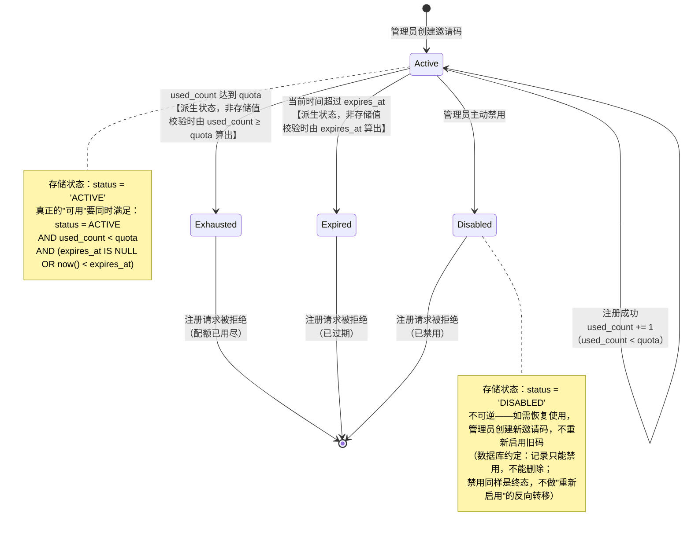

# ADR-0001: 邀请码注册机制的生命周期与授权模型

- **状态**：Accepted
- **日期**：2026-08-27
- **决策者**：@muye
- **技术相关人**：-

## 背景 / Context

[Issue #79](https://github.com/Paraview-RD/portico/issues/79) 提议为 Portico 增加邀请码注册机制：管理员发放带配额/有效期的邀请码，用户凭码自助注册，替代"关闭注册、全靠 SCIM 或管理员逐个建号"这一种极端。方案讨论时对比了 Casdoor、Keycloak、Zitadel、Authentik 四款同类产品的实现，确认采纳并对原始提案做了两处收窄：

- 去掉"邀请码可绑定角色"——四款参照产品无一支持,这会构成权限提升风险（邀请码泄露即可自授管理员角色）
- 去掉正则匹配码、issuer/channel 溯源字段——超出首个可用版本范围，留给后续迭代

本 ADR 记录两个会影响后续实现方式、且不写下来容易被后来者当成 bug 的决策：**邀请码的状态如何建模**，以及**注册时的组织/群组归属如何写入**。

## 候选方案 / Considered Options

### 决策点 A：邀请码的"用尽"和"过期"要不要存成字段

#### Option A1：`status` 字段包含 `ACTIVE` / `DISABLED` / `EXPIRED` / `EXHAUSTED` 四态，用后台任务或触发器维护
**优点**：
- 查询"当前可用的邀请码"时一次 `WHERE status = 'ACTIVE'` 即可，无需在查询时计算

**缺点**：
- `database-conventions.md` 明确禁止触发器和存储过程，行为要留在服务层——四态字段意味着需要一个后台任务定期把过期/用尽的记录改状态，属于本仓库没有的基础设施
- 状态和实际数据（`expires_at`、`used_count` vs `quota`）变成两份真相，任务没跑到之前两者会短暂不一致

#### Option A2：`status` 只存 `ACTIVE` / `DISABLED`（管理员主动操作），过期与用尽在校验时刻由 `expires_at` 和 `used_count >= quota` 计算得出，不落库
**优点**：
- 与 `database-conventions.md` 的"No triggers and no stored procedures"一致，且与仓库里其他资源表（`oauth_clients` 等只用 `ACTIVE`/`DISABLED` 描述管理员可控状态）的既有模式一致
- 没有第二份真相需要保持同步，`expires_at` 和 `used_count` 本身就是权威数据源
- 与 Casdoor 的模型吻合：`State` 只表示 `Active`/`Suspended`（管理员操作），配额和用量是分开跟踪的独立字段

**缺点**：
- 每次校验邀请码都要额外比较 `expires_at` 和 `used_count`，而不是单纯查一个字段——但这本来就是校验逻辑必须做的比较，不算额外成本

### 决策点 B：注册时的组织/群组归属如何写入新用户

#### Option B1：先按现有逻辑创建用户（组织留空，按 `auth_flow.go:708-709` 的既有设计），注册成功后再调用 `GroupService.AddMembers` / 组织分配的管理端方法，把邀请码携带的组织/群组信息补写进去
**优点**：
- 不改动 `UserService.Create` 的输入结构，改动面小

**缺点**：
- `GroupService.AddMembers(ctx, tenantID, groupID, userIDs, actor auth.Principal)` 要求一个已登录的 `auth.Principal` 做审计和权限检查——注册流程此刻的用户还没有身份，只能伪造一个系统级 Principal 去满足签名，这本质上是在绕开授权检查而不是真的通过它，容易在未来的审计/权限收紧中被误当成一个洞
- 建号和归属分成两次写入，中间存在"用户已创建但组织/群组未写入"的窗口；如果第二步失败，用户会以不完整状态留存，需要额外补偿逻辑

#### Option B2：在 `CreateUserInput` 新增 `GroupIDs []string`，与既有 `OrganizationID` 并列，在 `UserService.Create` 同一个事务内直接写入组织与群组归属，不经过任何以 `auth.Principal` 为前提的授权 API
**优点**：
- 与 Casdoor、Authentik 的实现一致：两者在新用户/新记录写入的那一刻直接落库归属信息，都不经过"先建号、再用已登录身份二次操作"的路径——Authentik 甚至把这一点写进了官方文档，用 Expression Policy 在 User Write Stage 之前把 `groups_to_add` 直接注入创建上下文
- 建号与归属在同一事务，不存在中间不一致状态
- 语义正确：**邀请码本身就是授权凭证**——它已经证明了"这次注册有权限归属到某组织/群组"，不需要再借用一个不存在的管理员身份去二次证明

**缺点**：
- 需要修改 `CreateUserInput` 结构体，涉及 `UserService.Create` 内部实现；改动面比 B1 大，但改动是加字段+加一段写入逻辑，不是重构

## 决策 / Decision

**决策点 A 采纳 Option A2**：`invitations.status` 只存 `ACTIVE`/`DISABLED`，过期与用尽在校验时刻由 `expires_at`、`used_count` 与 `quota` 比较得出，是**派生状态，不落库**。

**决策点 B 采纳 Option B2**：`CreateUserInput` 新增 `GroupIDs []string`，与 `OrganizationID` 并列，在 `UserService.Create` 同一事务内直接写入，不调用 `GroupService.AddMembers`。

理由：
1. 两个决策都是在"仓库已有的约束/模式"和"同类产品的一致做法"的交集里选出来的，不是标新立异
2. 决策点 B 会**局部覆盖** `auth_flow.go:708-709` "注册时组织留空、交给管理员事后分配"这条既有设计——但仅在邀请码路径生效：走邀请码注册时组织/群组预先写入，普通开放注册路径的行为完全不变，两条路径不冲突

## 邀请码完整生命周期

**读图说明**：图中只有 `Active` 和 `Disabled` 是数据库里真实存在的 `status` 值；`Exhausted` 和 `Expired` 是校验逻辑在每次尝试注册时，拿 `used_count`/`expires_at` 现算出来的判断结果，绝不会出现在 `status` 列里——这正是决策点 A 要落实的约束，写这张图的目的就是让后来者一眼看出"状态"和"派生结果"的边界在哪。

## 后果 / Consequences

**正面**：
- ✅ 邀请码表结构与仓库现有资源表（`oauth_clients`、`saml_service_providers` 等）的状态建模方式保持一致，不引入新的模式
- ✅ 不需要新增任何后台任务/定时任务来维护状态一致性
- ✅ 组织/群组归属与用户创建原子完成，不存在"半注册"用户
- ✅ 不需要在注册这个匿名流程里伪造一个 `auth.Principal`，避免留下一个容易被误读的"授权检查旁路"

**负面 / 权衡**：
- ⚠️ 校验逻辑要同时读三个字段（`status`、`used_count`、`expires_at`）做比较，比单纯查一个枚举字段多几行代码——但这是把复杂度放在读的一侧、换取写的一侧没有额外状态同步任务，是有意的取舍
- ⚠️ `CreateUserInput` 的调用方变多了一个可选字段 `GroupIDs`，未来所有构造 `CreateUserInput` 的地方（管理端建号、SCIM 供给等）需要确认自己传的是 `nil`，不会误传导致意外的群组归属

**风险缓解**：
- `GroupIDs` 为 `nil`/空切片时行为与现在完全一致（不写入任何群组关系），非邀请码路径不受影响
- 邀请码校验与 `used_count` 原子递增必须在同一事务，且用 `UPDATE ... WHERE used_count < quota RETURNING used_count` 模式防止并发超发，实现时需要专门的并发测试覆盖这条路径，不能只测 happy path

## 相关

- 涉及代码：`internal/service/auth_flow.go`（`RegisterInput`、`UserService.Register`）、`internal/service/user.go`（`CreateUserInput`、`UserService.Create`）、`internal/service/group.go`（`GroupService.AddMembers`，本次决策明确不复用它）
- 相关文档：[`docs/database-conventions.md`](../database-conventions.md)（状态字段与复合外键约定）、[GitHub issue #79](https://github.com/Paraview-RD/portico/issues/79)
- 参照的同类产品实现：[Casdoor Invitation](https://casdoor.ai/docs/invitation/overview/)、[Authentik Invitation stage](https://docs.goauthentik.io/add-secure-apps/flows-stages/stages/invitation/)
- Superseded by：-
- Supersedes：-
