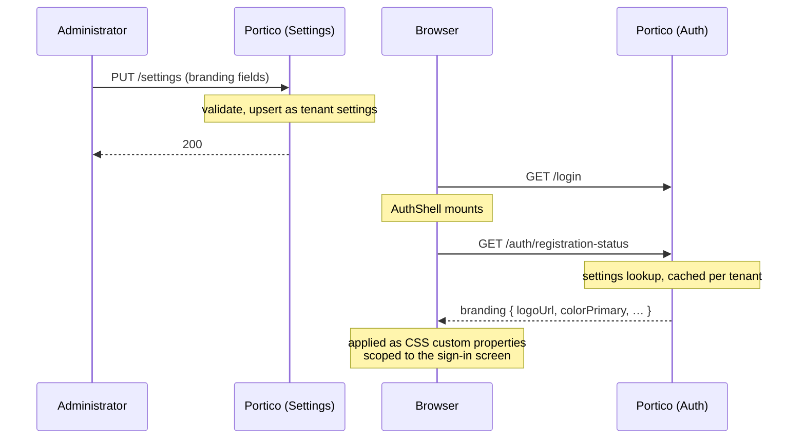

# Branding

Overrides what the four unauthenticated screens — sign-in, register,
forgot-password, authorize — show in place of Portico's own name, mark and
colour. The administrative console is unaffected: an operator's own team
sees Portico; only a visitor who has not signed in yet sees the brand.

Reached from its own entry in the sidebar rather than a card on this
screen — it grew past that once it needed a live preview and two long-text
fields, the same way provisioning and identity providers were pulled out
before it.

Global and per-tenant, on the same fallback every other setting here
already uses: a tenant that has set nothing inherits the deployment's
default, matching how `System name` already behaves.

| Field | What it changes |
|---|---|
| Logo | The mark beside the product name. Accepts an uploaded picture (through the same PNG/JPEG pipeline application tiles use) or a path on this server. |
| Product name | Replaces "Portico" in the header. |
| Primary colour | A 6-digit hex colour. Buttons and links on these four screens follow it; the console's own palette does not. |
| Font family | One of a short list of built-in stacks — not free text. The `Content-Security-Policy` this server sends is `font-src 'self'`, so an external font file can never load here; a free-text field would mostly let somebody type something that silently did nothing. |
| Background image | Behind the sign-in card. Accepts an uploaded picture (same pipeline as the logo, wider limits — see below) or a full `https` address. |
| Footer links | Three named slots — privacy policy, terms of service, support contact. Each is off, an external address, or plain text shown on this page — not an open list, and not a page of its own. |
| Sign-in heading | Replaces the default heading on the sign-in screen specifically; the other three screens keep their own. |

**The footer is three slots, not a list an operator supplies text for.**
Each label is drawn from this console's own translation catalogue and
appears in whichever language the visitor's browser is showing; only the
address or the text behind it is theirs to set. An open list of arbitrary
link text would mean every one of them needing its own translation,
decided by whoever is filling in a form rather than by this product's own
wording conventions — see [i18n conventions](i18n-conventions.md).

**A slot's inline text has no address of its own.** Choosing "text on this
page" for, say, the privacy policy opens the text in a dialog over
whichever of the four screens the visitor is on — it reuses the console's
existing dialog component rather than a new public page, so there is
nothing to route to and nothing new to keep reachable across a redeploy.
The trade taken deliberately: that text cannot be linked to or shared on
its own. A deployment that needs a linkable policy page uses the external
address instead. The text supports a small, deliberately incomplete markup
subset: `**bold**`, `*italic*`, `- ` lists, and a blank line starts a new
paragraph. **Link syntax is not recognised, on any of the four screens, on
purpose** — a link's address is the one part of this text that becomes an
executable action (a `javascript:` scheme, an open redirect), and
bold/italic/lists cannot carry one. A footer *link* already exists as its
own mechanism (the "external link" mode above, a validated address) — this
does not duplicate or extend that. The renderer never builds an HTML
string from this text; it parses it into React elements directly, so there
is no injection surface to sanitize in the first place.

**The sign-in heading is one field, not an open text-override layer.**
Every other string on these screens is translated and compile-time
checked — a typo in a translation key fails the build before it ships. An
open override keyed by string would sit outside that check entirely: a
mistyped key would silently do nothing, and nothing would say so. One named
field avoids the question by not having a key to typo.

**The logo reuses the application-logo upload**, the same mechanism and the
same limits (512 KiB, 1024 pixels on a side, PNG or JPEG only, SVG
refused — an SVG is a document that can carry a script, and one served back
from this origin and opened directly carries this origin's session with
it). It is not a new upload path with its own rules to keep in sync with
the first one.

**The background image reuses the same upload machinery** — same storage,
same `/t/<tenant>/logos/<id>` serving path, same format check — with wider
limits (4 MiB, 2560 pixels on a side) than the logo's, because a background
fills the whole screen rather than a small tile.

How a save reaches a visitor who has not signed in:

**The preview beside the fields is local to the browser, not a draft.**
It renders the same code the real sign-in screen does, fed from whatever
is currently typed into the form — so it updates as the fields change, but
nothing about it is sent to the server or stored until Save is pressed.
That is the one exception to "there is no staged rollout" worth stating
precisely: there is still no server-side draft, no second copy of the
settings row, and no preview URL a visitor could stumble onto — only a
local rendering of values that have not been saved yet. Pressing Save
takes effect immediately for the next visitor, same as every other setting
on this screen.
