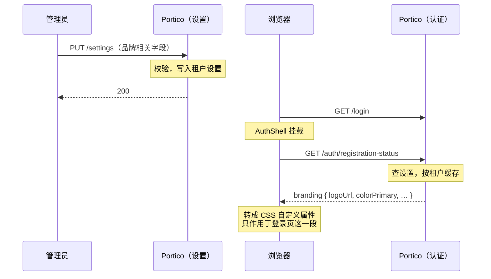

# 品牌定制

覆盖登录、注册、找回密码、授权确认这四个未登录页面上原本显示 Portico 自身名称、
标志与配色的内容。管理控制台不受影响——本方运维看到的仍是 Portico，只有还没登录
的访客会看到这份品牌。

从侧边栏自己的入口进入，不再是这一页上的一张卡片——原因和当初把目录对接、身份
提供方从设置页拆出去一样：它长出了实时预览和两个长文本字段，一张卡片已经装不下。

全局与按租户两级，回退规则和这一页其它设置一致：某租户未设置的字段，跟随部署的
全局默认值，与`系统名称`已有的行为相同。

| 字段 | 改变的内容 |
|---|---|
| 标志 | 名称旁的图标。可上传图片（走的是应用图标同一套 PNG/JPEG 上传管线），也可以填本服务器上的路径。 |
| 产品名称 | 替换页头的「Portico」。 |
| 主色 | 6 位十六进制颜色值。这四个页面上的按钮与链接会跟随它，控制台自身的配色不受影响。 |
| 字体 | 从内置的少数几个字体栈里选，不是自由输入。本服务器发送的 `Content-Security-Policy` 是 `font-src 'self'`，外部字体文件在这里永远加载不了；自由输入字段基本只会让人打进去一个静默不生效的值。 |
| 背景图片 | 显示在登录卡片背后。可上传图片（复用标志同一套上传管线，限制更宽——见下文），也可以填完整的 `https` 地址。 |
| 页脚链接 | 三个具名坑位——隐私政策、服务条款、支持联系方式。每个坑位可以不显示、指向外部地址，或直接在本页显示一段文字——不是任意列表，也不是独立页面。 |
| 登录页标题 | 只替换登录页自身的默认标题，其余三个页面保留各自的标题。 |

**页脚是三个具名坑位，不是让运维自己填文字的列表。** 每条文案取自控制台自身的翻译
词表，跟随访客浏览器所用的语言显示；运维只填地址，或者地址背后的正文。若做成任意
文字的列表，每一条都要单独翻译，且措辞由填表的人决定，而不是这个产品自己的行文
规范——参见 [i18n 约定](i18n-conventions.md)。

**某个坑位选了"站内正文"，这段文字就没有自己的地址。** 以隐私政策为例，选中它后
点击链接会在当前这四个页面里的任意一个上弹出一个对话框——复用的是控制台已有的
对话框组件，而不是一个新的公开页面，所以没有新的路由要维护，也没有新的地址要在
每次发版后保证还能打开。这是刻意接受的代价：这段文字没法被单独分享或加书签。真
需要一个可以直接分享链接的政策页，就用外部地址那个选项。正文支持一小部分故意不
完整的排版：`**加粗**`、`*斜体*`、`- ` 列表，空行分段。**这四个页面上都不识别链接
语法，是故意的**——一段文字里唯一能变成可执行动作的部分是地址本身（`javascript:`
协议、开放重定向之类），加粗、斜体、列表都带不了这个。页脚本身已经有"外部链接"
这个具名模式（校验过的地址）——这里不重复、也不扩展它。渲染器从不把这段文字拼成
HTML 字符串，而是直接解析成页面元素，所以从一开始就没有可以注入的地方，无需再做
清洗。

**登录页标题是一个具名字段，不是开放的文案覆盖层。** 这几个页面上其余的每一句话
都是翻译键，且在编译期检查——键名写错，构建过不了。一个以字符串为键的开放覆盖层
会绕开这层检查：键名打错，就静默地什么也不做，也没有任何提示。用一个具名字段，
就没有键名可打错。

**标志复用应用图标的上传机制**，同一套限制（512 KiB、单边不超过 1024 像素、只收
PNG/JPEG、拒绝 SVG——SVG 是一份可以带脚本的文档，从本源直接返回并被直接打开时，
带的是本源的会话）。不是另起一条要和第一条保持同步的新上传通道。

**背景图片复用同一套上传机制**——同一张表、同一条 `/t/<租户>/logos/<id>` 提供
地址、同一套格式校验——只是限制更宽（4 MiB、单边不超过 2560 像素），因为背景图
铺满整个屏幕，不是一枚小图标。

一次保存如何抵达一位还没登录的访客：

**字段旁边的预览是浏览器本地的，不是草稿。** 它跑的是和真实登录页同一份渲染代码，
数据来自表单里当前填的内容——所以字段一改它就跟着变，但在按下保存之前，这些值不
会发给服务器，也不会被存下来。这也是"没有分阶段发布"这句话唯一需要说得更精确的
地方：依然没有服务器端的草稿、没有第二份设置记录、也没有访客能碰巧撞见的预览地址
——有的只是把还没保存的值在本地渲染出来。按下保存后，和这一页其它设置一样，对下
一位访客立即生效。
