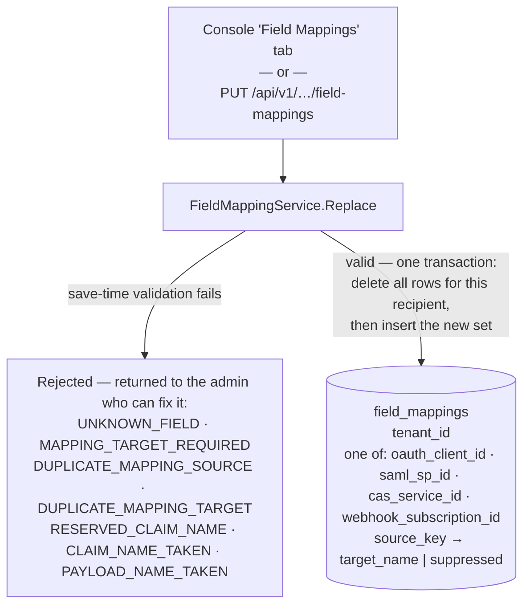
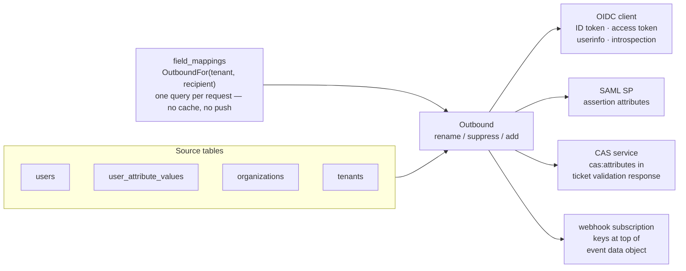

# Field Mappings

Every application Portico signs somebody into receives a set of facts about
them, under names Portico chose. Most integrations are fine with that. The
ones that are not have exactly two problems, and this is where both are
solved: **the name is wrong**, or **the fact is not sent at all**.

A service provider maps on the name it is given. If it reads `dept` and
Portico sends `department`, the field arrives and is discarded. Before this
existed the only way in was a code change, applied to every application at
once.

## What can be mapped

`GET /api/v1/fields` returns the catalogue — the list of everything that may
be named. It has two halves:

| | |
|---|---|
| **Built in** | Identity, the twenty-five SCIM profile attributes, the organization, the tenant |
| **Yours** | Whatever attributes this tenant defined for itself, under **System → User attributes** in the console |

Both halves are addressed the same way. A mapping stores a **key** from this
list, never a column name — see [the note below](#lists-not-column-names).

### Defining one of your own

**System → User attributes** in the console, or `POST /api/v1/user-attributes`.
An attribute has a key, a name to show, a type (text, number, yes/no, date, or
one of a list), and optionally is required. It then appears on every account's
form and joins the catalogue as one more thing that may be mapped — but it is
not sent to anything until a rule names it.

The key is fixed once defined, because a mapping stores it: renaming it would
stop whichever rule names it while the screen that rule was configured on still
looked right.

Two ways to stop using one, and they are not the same:

| | |
|---|---|
| **Retire** | Off the account forms, out of the picker. Every value already recorded is kept and still reaches an application that maps it — the answer to a question somebody asks later |
| **Delete** | The definition and every value recorded under it, on every account, discarded. Not reversible |

The answers themselves are edited per account, in the **Attributes** section of
the account dialog on the users screen, or through
`PUT /api/v1/users/{id}/attributes`. An empty answer is not recorded at all,
which is why clearing a field removes what was there rather than storing a
blank.

**Nothing is ever sent empty.** A field with no value for an account is absent
rather than present and blank, so a service provider that never receives a
field it mapped should look at the account rather than at the mapping.

One asymmetry to know about, in webhook payloads only. That rule governs what a
*mapping* sends. The default `profile` object inside a `user.*` event has
always carried its members as empty strings when the account has no value for
them, and still does — so an account with no cost centre shows
`profile.costCenter: ""` in the default body and nothing at all if you map
`cost_center` to a name of your own. Both are true statements about the same
account and they are not written the same way. Changing the default body would
be a breaking change for every existing subscriber, so it has not been made.

## What a rule does

Three things, and a rule does exactly one of them:

| | |
|---|---|
| **Rename** | A fact that is already sent, under a different name |
| **Suppress** | A fact that is already sent, no longer sent at all |
| **Add** | A fact that was never sent, sent under a name you choose |

Suppression is a flag rather than an empty name, because "send nothing" and
"send under a name I have not decided yet" are different intentions.

Adding is the larger half. The twenty-five profile attributes are stored,
arrive over SCIM, and by default reach no application at all.

### Mapping type determination

A rule looks the same in all three cases: a key, and a name. Which of the three
it turns out to be is decided by whether the recipient already sends that field
by default.

For OpenID Connect the list of fields that are sent by default is ten, and it
is fixed:

```
username        -> preferred_username        tenant_id
display_name    -> name                      tenant_code
email                                        role
phone           -> phone_number              organization_id
updated_at                                   organization_name
```

A rule naming one of those ten **renames** — the claim was going out anyway,
and now it goes out under your name instead of Portico's. A rule naming
anything else **adds**: every custom attribute, and all twenty-five profile
attributes, are in this half.

The difference matters when reading what an application actually receives.
Suppose a tenant defines three attributes of its own and an application maps
two of them:

| What is configured | What the application receives |
|---|---|
| Two custom attributes mapped, one left alone | **Two claims.** The third is absent entirely — not under its own name, not under any name. It was never sent by default, so there is nothing for "unmapped" to fall back to |
| `email` and `phone` mapped, `display_name` left alone | **Three claims.** The first two under the names you chose, the third as `name` — the default it always had |

So "one original field plus two mapped ones" is right for the built-ins in that
table of ten, and wrong for everything else. For a custom attribute, no mapping
means no field.

SAML, CAS, and webhooks each have their own defaults — see
[Federation](federation.md) — but the rule is the same: check whether the field
is in that protocol's default set, and you know which of the three you are
doing.

## Where they are configured

Per recipient, and there are four kinds:

```
PUT /api/v1/applications/oauth-clients/{clientID}/field-mappings
PUT /api/v1/applications/saml-service-providers/{id}/field-mappings
PUT /api/v1/applications/cas-services/{id}/field-mappings
PUT /api/v1/webhooks/{id}/field-mappings
```

In the console each of the four carries a **Fields** button — on the
applications screen for the first three, on the webhooks screen for the fourth
— which opens one editor over the whole catalogue. The API below is the same
thing without the browser.

`GET` on the same path reads them back. A save **replaces the whole set** —
what the form sends is the table somebody edited, and merging would leave the
rows they deleted in place. Sending an empty list restores the defaults.

```bash
curl -X PUT https://<host>/api/v1/applications/oauth-clients/wiki/field-mappings \
  -H "Authorization: Bearer <admin token>" \
  -H 'Content-Type: application/json' \
  -d '{"mappings":[
        {"sourceKey":"department","targetName":"dept"},
        {"sourceKey":"organization_path","targetName":"org_path"},
        {"sourceKey":"phone","suppressed":true}
      ]}'
```

### An empty set means the defaults

Not "sends nothing" — the defaults, exactly as documented for each protocol.
This is deliberate and it is what makes the feature safe to deploy: an upgrade
changes nothing until somebody decides something, and a row in the table means
somebody decided something. There are no pre-filled rules to tell apart from
deliberate ones.

## How a rule reaches an application

There is no synchronisation step. Nothing pushes a rule anywhere, no queue
carries it, no timer picks it up. It is read out of the database at the moment
facts leave, on the request that needs it — which is why a save takes effect on
the next request through that channel, with no restart and no wait.

Saving one:



No rows for a recipient means the defaults, unchanged.

The delete and the insert are one transaction on purpose. A clear that
committed without its rewrite would leave no rows — which does not mean "sends
nothing", it means the defaults, so half of that save would silently send more
than the state before it did.

Applying one:



`Outbound` is the whole vocabulary a protocol package gets. For a fact the
protocol already sends it asks *has this been renamed, or suppressed*; once per
response it asks *what else should be added*. There is no third question and no
raw access to the rows, which is what keeps four call sites from drifting into
four dialects of the same feature.

The rules themselves only ever travel to an administrator. `GET` on the paths
above lives under the admin API and needs an admin token; no application can
ask what its own mapping is, and none is told that it has one.

### When a change takes effect

| | |
|---|---|
| **OIDC** | The next ID token or access token issued. `userinfo` and introspection re-read on every call, so those two change immediately |
| **SAML** | The next sign-in — the assertion is assembled then |
| **CAS** | The next ticket validation |
| **Webhooks** | The next event **published**. The body is rendered and queued at that moment, so anything already in the queue keeps the shape it was made with |

Nothing already issued is rewritten. A token signed before the save carries the
old names until it expires — so *"the downstream system still sees the old
field"* most often means the other side is holding a token from before, and the
answer is to let it expire or sign in again rather than to change the mapping.

### When the rules cannot be read

The database is unreachable, or the query fails. The four channels do not answer
this the same way, and the difference is deliberate:

| | |
|---|---|
| **OIDC, SAML, CAS** | The request fails. A suppression is somebody's decision that this application must not receive a field, and falling back to the defaults would send it anyway |
| **Webhooks** | Logged at error level, and the **default** body is delivered. `publish` is called from an operation that already succeeded — an account exists, an organization was renamed — so a failure here may cost a rename, never an event |

## What the name means, per recipient

**OpenID Connect** — the target is a claim name.

Rules apply everywhere a claim can come out: the ID token, the access token,
the userinfo endpoint, and introspection. A rename that held in one and not
another would be a rename half the integration missed, and a suppression that
held in one and not another would be a disclosure decision an application
could get around by asking a different endpoint.

!!! note "What is never mappable"

    `sub` is reserved on both sides — nothing can be renamed onto it and
    nothing can be renamed away from it — because an application's whole trust
    model rests on it naming one person consistently.

    `email_verified` and `phone_number_verified` follow the claim they
    describe: sent when it is sent under its own name, and not otherwise. They
    are always false in this version, so offering them as mappable fields
    would be offering a constant somebody would read as a fact.

**SAML** — the target is the attribute `Name`, which is what a service
provider actually maps on. `friendlyName` sits beside it and is advisory;
setting it does not change what the SP matches.

**CAS** — the target is an element name in the ticket validation response;
the `cas:` prefix is added for you. `cas:user` is **not** an attribute and not
mappable: it is what every CAS client keys its local record on, and it is the
counterpart of `sub` one protocol over.

**Webhooks** — the target is a key at the top level of the event's `data`
object. This one has consequences the others do not, below.

## Webhooks

The three protocols above assemble a claim set or an attribute list field by
field. A webhook body is not assembled — it is whatever the account or
organization marshals to, and has been since before this feature existed. So
here the rules are applied **on top of** the default body rather than instead
of it. Everything the payload carried, it still carries.

**A subscription's rules are its own.** They are rows against
`webhook_subscription_id`, and nothing an application is configured with reaches
them: mapping `department` to `dept` for the wiki changes nothing about what a
webhook receives. This is a receiver being told what it expects, not a tenant
declaring one vocabulary — so a subscription with no rules of its own delivers
Portico's own field names, whatever the applications beside it were configured
with. Each subscription has a **Fields** button on the webhooks screen,
opening the same editor the applications use.

**What may be added depends on what the event is about.** A `user.*` event has
an account behind it, so anything in the catalogue may be added to it,
including the tenant's own attributes. An `organization.*` event has no
account, so only the fields that can be computed from an organization are
available — its code, its path, its parent, its manager, and the tenant it
belongs to. Naming an account field in a rule on an organization event is not
an error; there is simply no value to send, and nothing is sent. Renames and
suppressions over the default body work on both.

**A rename lifts.** A nested field like `profile.department` cannot stay
nested under a new name, because a target is one name. So it moves to the top
level of `data` and is removed from `profile`:

```json
{
  "id": "…", "displayName": "…",
  "dept": "Analytical Engines",
  "profile": { "title": "Engineer" }
}
```

If lifting empties `profile` entirely, the object is dropped rather than sent
as `{}`.

**Group events are not mapped.** `group.created`, `group.updated`,
`group.deleted` and `group.members_changed` carry a group, and there is no
group vocabulary in the catalogue. Their payloads are delivered exactly as
they always were, even for a subscription that has configured rules for
accounts. This is a decision, not an omission.

**A queued delivery keeps the body it was rendered with.** Payloads are
rendered when the event happens, not when it is sent. Changing a mapping
affects events from that point on; anything already waiting in the queue —
including anything being retried — goes out in the shape it was made. An event
describes what happened, and re-rendering it later would deliver a
`user.disabled` describing an account somebody has since re-enabled.

## What will be refused

At save time, in front of somebody who can fix it — rather than at sign-in, in
front of somebody who cannot.

| | |
|---|---|
| `RESERVED_CLAIM_NAME` | The name is one OpenID Connect acts on: `sub`, `iss`, `aud`, `exp`, `nonce` and the rest. **OIDC applications only** — a SAML attribute called `sub` is unremarkable |
| `DUPLICATE_MAPPING_SOURCE` | Two rules for one field. Which wins would be decided by whichever was read first |
| `DUPLICATE_MAPPING_TARGET` | Two fields under one name. Only one would arrive, and not the one you picked |
| `CLAIM_NAME_TAKEN` | An OIDC rename onto a claim this system already sends — `department` onto `tenant_id`. Not reserved by the specification, and just as occupied |
| `PAYLOAD_NAME_TAKEN` | A webhook rename onto a name the event already uses for something else — `department` onto `id` |
| `MAPPING_TARGET_REQUIRED` | Neither a name nor a suppression, so the rule says nothing |
| `UNKNOWN_FIELD` | No such key in the catalogue. Usually a typo |

The first is the one with teeth. Renaming a department to `nickname` is
somebody's business; renaming it to `sub` would tell an application that one
person is another, in a token it has every reason to trust.

## Which applications receive a given fact

The four kinds share one table, which is what makes this answerable in one
query rather than four. It is the question asked after a disclosure review and
not before one: *who is receiving `department`?*

## Lists, not column names

The cheaper design lets a mapping name a database column. The `users` table
also holds `password_hash`, `token_version`, and `failed_login_attempts`.

A configuration that can name a column is one that will eventually name one of
those — and it would be a tenant administrator doing it, through a supported
field, with no code review anywhere in the way. So the catalogue is an
enumeration, and a key it does not hold is refused.

Some entries are outbound-only, and the list says why for each. Several are
security boundaries rather than omissions: a directory attribute that could
set `role` would put privilege escalation in a system Portico does not own.
See [Reading a directory](ldap.md) for where that line is drawn.

## See also

- [Webhooks](webhooks.md) — registering a subscription, signatures, retries
- [Provisioning](scim.md) — where the profile attributes come from
- [Federation](federation.md) — what each protocol sends by default
