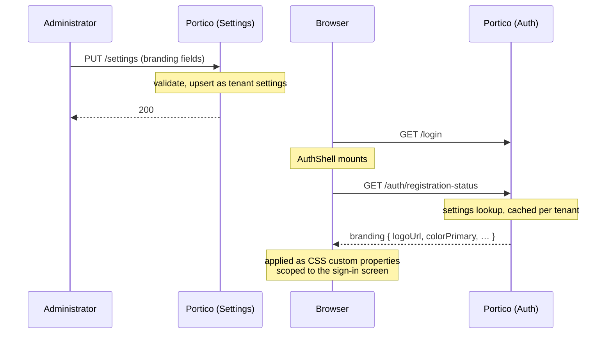

# Settings and the audit trail

Everything on the settings screen is a **tenant-wide default that takes
effect for everybody the moment it is saved**. There is no staged rollout and
no dry run, so the two irreversible ones below are worth reading before
touching.

## Irreversible settings

**Lowering audit retention deletes.** Entries past the new limit are removed
permanently by the next sweep, with no copy kept. Export anything needed
long-term first.

**Raising the maximum session age above zero ends sessions that are
working.** It is measured from the sign-in rather than from the last
refresh, so integrations that have been running for months reach it
immediately. Zero — the default — switches it off.

Everything else is reversible: tightening a password rule does not
invalidate existing passwords, it only applies to the next change.

## Session types

This confuses people, and the two are unrelated.

| | What it governs |
|---|---|
| **Console session lifetime** | How often *this interface* asks you to sign in again |
| **Single sign-on tokens** | What Portico issues to the applications connected to it |

An administrator shortening the first because "sessions should be shorter"
has changed nothing about the applications, and vice versa. See
[Federation](federation.md) for what the second group means to an
integrator.

## Sign-in security

**Lockout** locks an account after a number of consecutive failed sign-ins,
counted over a window. Zero switches it off.

It is not rate limiting, and the two cover different attacks: lockout stops
one account's password being guessed, and does nothing about the load of a
large number of attempts. The rate limits are elsewhere and none of them is
set here — the per-address floor on `/api/v1/auth/*`, configured with
`PORTICO_AUTH_RATE_LIMIT` at startup, and the real one in your reverse
proxy. See [Getting in](access-guide.md).

**Password recovery is capped separately**, at five messages per account per
day, and that one is not configurable at all. What it protects is not this
tenant: a sending quota and a sender reputation are spent by every message
and shared by every tenant on the deployment, and losing either takes
recovery down for all of them. A setting here would put the decision with
the party that does not pay for it. Reaching the cap is silent to whoever
asked — saying "too many" out loud would confirm that the address has an
account here.

Silent is not the same as permanent. When somebody reports that no reset
message arrives, open **Reset password** on their account: if the cap is why,
the dialog says so and offers to start sending again, which is the lighter of
the two things you could do there. Setting a password by hand also works and
is the wrong shape — it means reading a password down a telephone to somebody
who never lost theirs.

The lock is checked *after* the password is compared, so a wrong guess never
learns that an account is locked. It does not extend on further attempts,
because otherwise anybody could keep any account locked indefinitely.

**Password policy** — composition, history, and expiry — is off by default.
Composition rules and forced expiry make passwords more guessable rather
than less, and NIST SP 800-63B recommends against both. They are here for
deployments audited against regimes that require them. If you have the
choice, leave them off and raise the minimum length.

## The language of what this tenant sends

`Default language` is the language of a password-reset link or a
registration confirmation sent to somebody who has stated no preference of
their own. Empty means "follow the deployment's `PORTICO_DEFAULT_LOCALE`",
and that is a real value rather than an absence: a tenant that has said
nothing follows a deployment that changes its mind later, instead of being
frozen at whatever it was the day it was created.

It does not affect the console. That is each reader's own choice and is
remembered in their browser.

## The explanation panels

`Show the explanation on each screen` offers the panel at the top of each
administrative screen. On by default; turn it off once your operators know
the product.

Each panel can also be collapsed individually, which is remembered per
browser rather than for everybody — so an operator who reads them daily can
put one away without deciding for the rest of the tenant.

## Branding

Overrides what the four unauthenticated screens — sign-in, register,
forgot-password, authorize — show in place of Portico's own name, mark and
colour. The administrative console is unaffected: an operator's own team
sees Portico; only a visitor who has not signed in yet sees the brand.

Reached from its own entry in the sidebar rather than a card on this
screen — it grew past that once it needed a live preview and two long-text
fields, the same way provisioning and identity providers were pulled out
before it.

Global and per-tenant, on the same fallback every other setting here
already uses: a tenant that has set nothing inherits the deployment's
default, matching how `System name` already behaves.

| Field | What it changes |
|---|---|
| Logo | The mark beside the product name. Accepts an uploaded picture (through the same PNG/JPEG pipeline application tiles use) or a path on this server. |
| Product name | Replaces "Portico" in the header. |
| Primary colour | A 6-digit hex colour. Buttons and links on these four screens follow it; the console's own palette does not. |
| Font family | A CSS `font-family` value. |
| Background image | Behind the sign-in card. |
| Footer links | Three named slots — privacy policy, terms of service, support contact. Each is off, an external address, or plain text shown on this page — not an open list, and not a page of its own. |
| Sign-in heading | Replaces the default heading on the sign-in screen specifically; the other three screens keep their own. |

**The footer is three slots, not a list an operator supplies text for.**
Each label is drawn from this console's own translation catalogue and
appears in whichever language the visitor's browser is showing; only the
address or the text behind it is theirs to set. An open list of arbitrary
link text would mean every one of them needing its own translation,
decided by whoever is filling in a form rather than by this product's own
wording conventions — see [i18n conventions](i18n-conventions.md).

**A slot's inline text has no address of its own.** Choosing "text on this
page" for, say, the privacy policy opens the text in a dialog over
whichever of the four screens the visitor is on — it reuses the console's
existing dialog component rather than a new public page, so there is
nothing to route to and nothing new to keep reachable across a redeploy.
The trade taken deliberately: that text cannot be linked to or shared on
its own. A deployment that needs a linkable policy page uses the external
address instead. The text itself is plain — a blank line starts a new
paragraph, and nothing else is applied; there is no Markdown or HTML
renderer on any of the four screens, on purpose, so nothing an
administrator pastes in ever executes.

**The sign-in heading is one field, not an open text-override layer.**
Every other string on these screens is translated and compile-time
checked — a typo in a translation key fails the build before it ships. An
open override keyed by string would sit outside that check entirely: a
mistyped key would silently do nothing, and nothing would say so. One named
field avoids the question by not having a key to typo.

**The logo reuses the application-logo upload**, the same mechanism and the
same limits (512 KiB, 1024 pixels on a side, PNG or JPEG only, SVG
refused — an SVG is a document that can carry a script, and one served back
from this origin and opened directly carries this origin's session with
it). It is not a new upload path with its own rules to keep in sync with
the first one.

How a save reaches a visitor who has not signed in:

**The preview beside the fields is local to the browser, not a draft.**
It renders the same code the real sign-in screen does, fed from whatever
is currently typed into the form — so it updates as the fields change, but
nothing about it is sent to the server or stored until Save is pressed.
That is the one exception to "there is no staged rollout" worth stating
precisely: there is still no server-side draft, no second copy of the
settings row, and no preview URL a visitor could stumble onto — only a
local rendering of values that have not been saved yet. Pressing Save
takes effect immediately for the next visitor, same as every other setting
on this screen.

## The audit trail

What is recorded has already happened — who signed in when, who changed
whom, what was touched. It is for finding out afterwards rather than
watching in real time.

**Entries are written and never edited, and there is no delete in the
interface.** That is what makes them worth anything as evidence, and it is
why this system disables accounts rather than deleting them: a disabled
account keeps its history, and a deleted one would leave the trail pointing
at nothing.

Retention is the setting above. The default keeps everything, which is the
only safe default — the trail is a record, not an operational buffer.

### What it will not tell you

An audit entry records what this server did or witnessed. It does not record
what a downstream system did afterwards with a profile it read: whether it
created an account, updated one, or discarded the response is known only to
it. An entry claiming otherwise would be an assertion the server never
witnessed.
