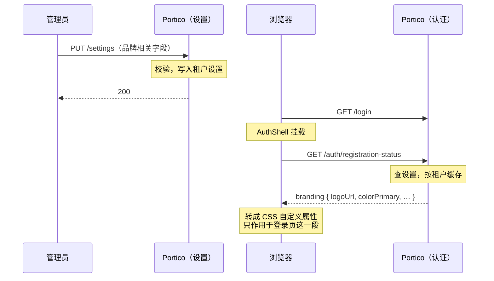

# 系统设置与审计

设置页上的每一项都是**租户级默认值，保存即刻对所有人生效**。没有灰度，也没有试运行
——所以下面这两项不可逆的，动之前值得先读。

## 不可逆操作

**调低审计保留天数会删除数据。** 超过新期限的条目会被下一次清理任务**永久删除，
不留副本**。需要长期留存的，请先导出。

**把最大会话时长从 0 调上去，会终结正在工作的会话。** 它是**从登录那一刻**算起、
而不是从最近一次刷新算起，所以已经跑了几个月的集成会立刻到期。默认值 0 表示关闭
这一项。

其余都是可逆的：收紧密码规则不会作废已有密码，只对下一次修改生效。

## 会话

这一点很容易混淆，而两者毫无关系。

| | 管的是什么 |
|---|---|
| **登录有效期** | **这个控制台**多久要求你重新登录一次 |
| **单点登录令牌** | Portico 发给**已接入应用**的那些令牌 |

一个管理员因为「会话应该短一点」而调小了前者，对那些应用**什么影响都没有**，反之
亦然。后一组对集成方意味着什么，见[联邦登录](federation.md)。

## 登录安全

**登录失败锁定**：在一个时间窗内连续失败若干次后锁定账号。填 0 表示关闭。

**它不是限流**，两者防的是不同的攻击：锁定防的是某一个账号的密码被猜中，对大量
尝试带来的负载无能为力。限流在别处，没有一处在这里配：一处是 `/api/v1/auth/*` 上按地址
的下限（启动时由 `PORTICO_AUTH_RATE_LIMIT` 配置），另一处、也是真正管用的那处，在你
的反向代理上——见[如何进入](access-guide.md)。

**密码找回另有一道上限**：每个账号每天五封，而且完全不可配。它保护的不是这个租
户——发信配额和发信域名声誉由每一封信共同花掉、由这台部署上的所有租户共享，丢掉
任何一个，所有租户的密码找回都跟着停摆。在这里放一个开关，等于把决定权交给不承担
代价的那一方。触到上限对提交的人是**无声**的——说一句「太频繁了」就等于确认这个地
址在这里有账号。

但无声不等于无解。有人报告收不到重置邮件时，在他的账号上打开**重置密码**：如果原因
就是这个，弹窗会写出来，并给出「恢复发送」——那是这里两个动作中较轻的一个。手动改
密码同样有效，但形状是错的：那等于把密码念给一个根本没丢密码的人听。

锁定状态是在**密码比对之后**才检查的，所以一次猜错的尝试永远不会得知某个账号被
锁了。锁定期间继续尝试**不会延长**它，否则任何人都能让任何账号一直锁着。

**密码策略**——复杂度、历史、有效期——默认全关。复杂度要求和强制过期反而会让密码
**更**容易被猜中，NIST SP 800-63B 明确不推荐这两项。它们存在，是因为不少部署要通过
强制要求它们的审计。如果你有选择权，**关掉它们，把最小长度调高**。

## 消息语言

`默认语言`指的是：发给**没有表达过自己偏好**的人的密码重置链接、注册确认信用什么
语言。留空表示「跟随部署级的 `PORTICO_DEFAULT_LOCALE`」——**这是一个真实的取值而不是
缺失**：什么都没说的租户会跟随之后改主意的部署，而不是被冻结在它创建那天的值上。

它不影响控制台。控制台语言是每个读者自己的选择，记在各自的浏览器里。

## 说明面板

`在各页顶部显示说明`控制管理页面顶部那块「这屏是做什么的」。默认开启；等你的运维
熟悉本产品后可以关掉。

单个面板也可以各自折叠，那是**按浏览器**记住的、不是替所有人决定——所以每天都读这
些页面的运维可以把某一块收起来，而不必替整个租户做主。

## 品牌定制

覆盖登录、注册、找回密码、授权确认这四个未登录页面上原本显示 Portico 自身名称、
标志与配色的内容。管理控制台不受影响——本方运维看到的仍是 Portico，只有还没登录
的访客会看到这份品牌。

从侧边栏自己的入口进入，不再是这一页上的一张卡片——原因和当初把目录对接、身份
提供方从设置页拆出去一样：它长出了实时预览和两个长文本字段，一张卡片已经装不下。

全局与按租户两级，回退规则和这一页其它设置一致：某租户未设置的字段，跟随部署的
全局默认值，与`系统名称`已有的行为相同。

| 字段 | 改变的内容 |
|---|---|
| 标志 | 名称旁的图标。可上传图片（走的是应用图标同一套 PNG/JPEG 上传管线），也可以填本服务器上的路径。 |
| 产品名称 | 替换页头的「Portico」。 |
| 主色 | 6 位十六进制颜色值。这四个页面上的按钮与链接会跟随它，控制台自身的配色不受影响。 |
| 字体 | 从内置的少数几个字体栈里选，不是自由输入。本服务器发送的 `Content-Security-Policy` 是 `font-src 'self'`，外部字体文件在这里永远加载不了；自由输入字段基本只会让人打进去一个静默不生效的值。 |
| 背景图片 | 显示在登录卡片背后。可上传图片（复用标志同一套上传管线，限制更宽——见下文），也可以填完整的 `https` 地址。 |
| 页脚链接 | 三个具名坑位——隐私政策、服务条款、支持联系方式。每个坑位可以不显示、指向外部地址，或直接在本页显示一段文字——不是任意列表，也不是独立页面。 |
| 登录页标题 | 只替换登录页自身的默认标题，其余三个页面保留各自的标题。 |

**页脚是三个具名坑位，不是让运维自己填文字的列表。** 每条文案取自控制台自身的翻译
词表，跟随访客浏览器所用的语言显示；运维只填地址，或者地址背后的正文。若做成任意
文字的列表，每一条都要单独翻译，且措辞由填表的人决定，而不是这个产品自己的行文
规范——参见 [i18n 约定](i18n-conventions.md)。

**某个坑位选了"站内正文"，这段文字就没有自己的地址。** 以隐私政策为例，选中它后
点击链接会在当前这四个页面里的任意一个上弹出一个对话框——复用的是控制台已有的
对话框组件，而不是一个新的公开页面，所以没有新的路由要维护，也没有新的地址要在
每次发版后保证还能打开。这是刻意接受的代价：这段文字没法被单独分享或加书签。真
需要一个可以直接分享链接的政策页，就用外部地址那个选项。正文支持一小部分故意不
完整的排版：`**加粗**`、`*斜体*`、`- ` 列表，空行分段。**这四个页面上都不识别链接
语法，是故意的**——一段文字里唯一能变成可执行动作的部分是地址本身（`javascript:`
协议、开放重定向之类），加粗、斜体、列表都带不了这个。页脚本身已经有"外部链接"
这个具名模式（校验过的地址）——这里不重复、也不扩展它。渲染器从不把这段文字拼成
HTML 字符串，而是直接解析成页面元素，所以从一开始就没有可以注入的地方，无需再做
清洗。

**登录页标题是一个具名字段，不是开放的文案覆盖层。** 这几个页面上其余的每一句话
都是翻译键，且在编译期检查——键名写错，构建过不了。一个以字符串为键的开放覆盖层
会绕开这层检查：键名打错，就静默地什么也不做，也没有任何提示。用一个具名字段，
就没有键名可打错。

**标志复用应用图标的上传机制**，同一套限制（512 KiB、单边不超过 1024 像素、只收
PNG/JPEG、拒绝 SVG——SVG 是一份可以带脚本的文档，从本源直接返回并被直接打开时，
带的是本源的会话）。不是另起一条要和第一条保持同步的新上传通道。

**背景图片复用同一套上传机制**——同一张表、同一条 `/t/<租户>/logos/<id>` 提供
地址、同一套格式校验——只是限制更宽（4 MiB、单边不超过 2560 像素），因为背景图
铺满整个屏幕，不是一枚小图标。

一次保存如何抵达一位还没登录的访客：

**字段旁边的预览是浏览器本地的，不是草稿。** 它跑的是和真实登录页同一份渲染代码，
数据来自表单里当前填的内容——所以字段一改它就跟着变，但在按下保存之前，这些值不
会发给服务器，也不会被存下来。这也是"没有分阶段发布"这句话唯一需要说得更精确的
地方：依然没有服务器端的草稿、没有第二份设置记录、也没有访客能碰巧撞见的预览地址
——有的只是把还没保存的值在本地渲染出来。按下保存后，和这一页其它设置一样，对下
一位访客立即生效。

## 审计记录

这里记的都是**已经发生的事**——谁在什么时候登录、改了谁、动了什么。它用于事后追查，
不是实时监控。

**记录只写不改，界面上没有删除。** 这正是它能当证据的前提，也是本系统**停用账号
而不删除账号**的原因：被停用的账号保留其历史，而被删除的账号会让整条轨迹指向一个
不存在的东西。

保留期就是上面那一项。默认是**永久保留**，这也是唯一安全的默认值——审计是记录，
不是运行时缓冲区。

### 审计记录的限制

一条审计记录记的是**本服务做了什么、或亲眼见到了什么**。它不记录下游系统在读取一份
用户资料之后做了什么：它是新建了账号、更新了账号，还是把响应丢掉了，**只有它自己
知道**。一条声称知道的记录，就是在轨迹里写下一个服务器从未见证过的断言。
