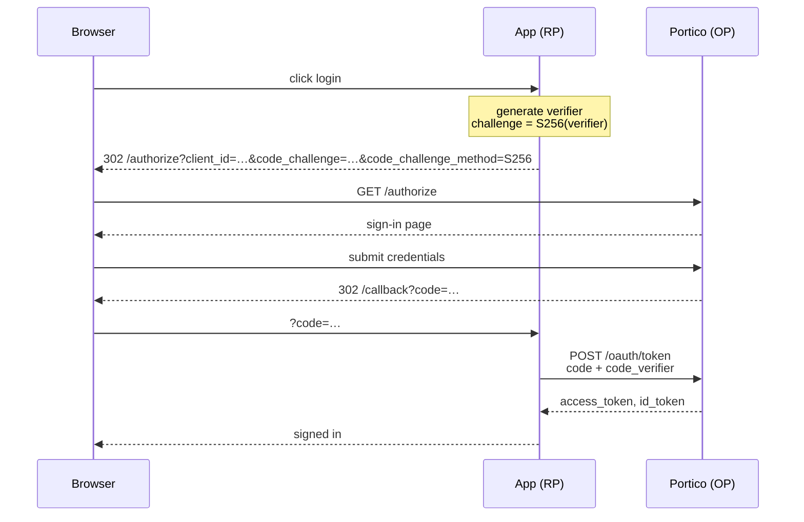
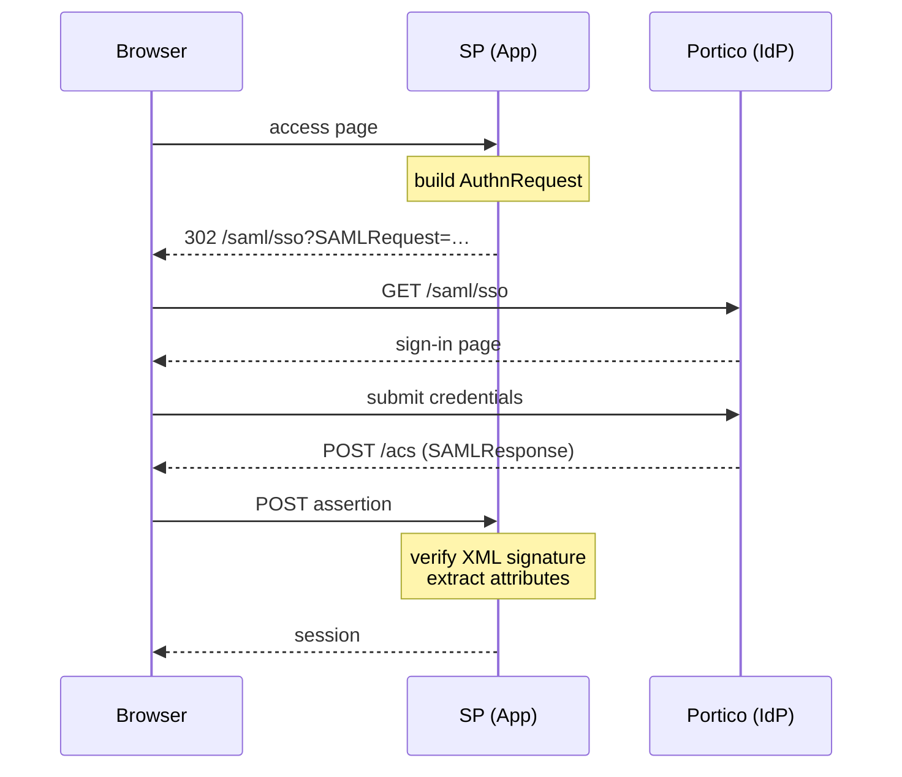
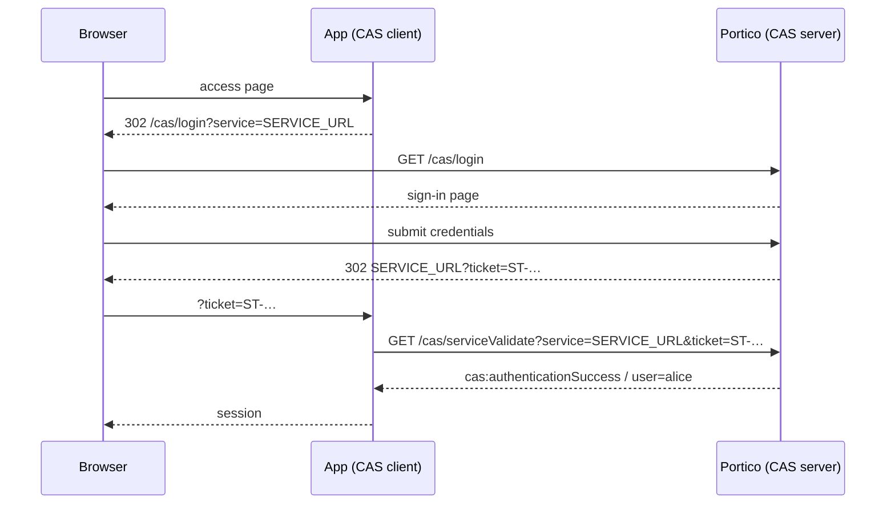

# SSO Protocols

Five concepts understood once, and the four protocols make sense on their
own terms rather than as a pile of unfamiliar names.

This page explains what the protocols are and what happens during a sign-in.
[Federation](federation.md) explains how to configure them.

## Roles: who is who

Every SSO flow involves two sides. The names differ by protocol, which is
the source of most of the confusion.

| Concept | OIDC name | SAML name | CAS name |
|---|---|---|---|
| The server that holds accounts and issues proof | OpenID Provider (OP) | Identity Provider (IdP) | CAS Server |
| The application that wants to sign somebody in | Relying Party (RP) | Service Provider (SP) | CAS Client / Service |

Portico is always on the left. The application integrating with it is always
on the right.

**Issuer** — a URL that identifies a particular OpenID Provider (or a
particular tenant within one). The OIDC discovery document lives at
`<issuer>/.well-known/openid-configuration`. A client configured with an
issuer URL finds everything else on its own.

## The proof differs by protocol

Each protocol carries identity differently when the sign-in completes.

| Protocol | What the app receives | Where to validate |
|---|---|---|
| OIDC | Access token (JWT) + ID token (JWT) | Signature verified against JWKS at `/keys` |
| SAML 2.0 | Assertion (signed XML) | Signature verified against IdP certificate |
| CAS | Service ticket (opaque string) | Back-channel call to `/serviceValidate` |

A token is a bearer credential — whoever holds it can use it, for as long
as it is valid. An assertion or a ticket is one-use proof issued for a
specific service and consumed immediately.

## Why the count is sometimes three, sometimes four

The capabilities table says four protocols. The federation page title says
three. Both are right.

**OAuth 2.1** is an authorization protocol. It says how an application may
act on behalf of a user — get a token, present the token, be believed. It
says nothing about who the user is.

**OpenID Connect 1.0** is an identity layer on top of OAuth 2.1. It adds an
ID token that answers "who signed in", and a userinfo endpoint that answers
"what do I know about them". Every OIDC sign-in is also an OAuth 2.1
exchange; every OAuth 2.1 exchange is not an OIDC sign-in.

Counted separately: four (OAuth 2.1, OIDC, SAML, CAS).
Counted by what a developer configures: three, because choosing OIDC gets
you both.

---

## OpenID Connect

The default choice for anything written in the last five years. A library
handles the protocol; the application sees a signed-in user.

**What you configure:** the issuer URL, the client ID, and for a public
client, nothing else — PKCE handles the rest.

**The one thing to know:** Portico implements OAuth 2.1, which requires
PKCE of every client — confidential clients included. A request without
`code_challenge` is refused. See [Troubleshooting](troubleshooting.md#pkce-required).

### Authorization Code flow with PKCE



**Already signed in?** If the browser already holds a valid session, Portico
skips the sign-in page and issues the code immediately. The user sees no
interruption. The session is a bearer token the console keeps in
`localStorage`, not a cookie; nothing in Portico sets one.

**No consent screen.** The administrator registering the application is the
authorization decision. Users are not asked to approve scopes.

### What the tokens carry

The ID token is a JWT. Decode it at [jwt.io](https://jwt.io) (offline) or
`portico client token` (locally) to see:

| Claim | Meaning |
|---|---|
| `sub` | User ID, stable and unique within this tenant |
| `name` | Display name |
| `email` | Primary email address |
| `preferred_username` | Username |
| `phone_number` | Phone number (if set and scope includes `phone`) |

The userinfo endpoint (`GET /userinfo`) returns the same facts as JSON.

### Further reading

[Federation → What is implemented](federation.md#what-is-implemented) —
full list of supported scopes, endpoints, and grant types.

[Federation → Claims](federation.md#claims) — every claim, with its source.

[Federation → Local testing](federation.md#local-testing) — run a
mock service provider against a local instance.

---

## SAML 2.0

The integration an enterprise product had built before OIDC existed. Uses
signed XML rather than JWTs. No library is optional — the signature
requirement makes hand-rolling SAML unsafe.

**What you configure:** exchange metadata. Hand Portico's metadata URL to
the service provider; hand the service provider's metadata XML to Portico.
The metadata carries the endpoints and the certificate each side needs.

**The one thing to know:** SAML has no single logout that works reliably.
Portico deliberately does not implement it. See
[Federation → Deliberately not implemented](federation.md#deliberately-not-implemented).

### SP-initiated flow



**Portico's metadata URL:**
```
https://<host>/saml/metadata              ← default tenant
https://<host>/t/<code>/saml/metadata     ← other tenants
```

### Further reading

[Federation → SAML 2.0](federation.md#saml-20) — metadata exchange,
attribute release, and certificate rotation.

---

## CAS

Used by university portals and Java applications that adopted it before
SAML or OIDC were widely available. Simpler than SAML, stateful by design.

**What you configure:** the CAS server URL (Portico's `/cas` path) and the
service URL (your application's callback). The service URL must be
registered in Portico.

**The one thing to know:** CAS tickets are single-use and expire quickly.
The service-validate call must happen immediately after redirect. Caching a
ticket or validating it twice fails.

### Login flow



**CAS server URL to configure in the client:**
```
https://<host>/cas              ← default tenant
https://<host>/t/<code>/cas     ← other tenants
```

**Validate endpoint:** `/cas/serviceValidate` (CAS 2.0) or
`/cas/p3/serviceValidate` (CAS 3.0, returns more attributes).

### Further reading

[Federation → CAS](federation.md#cas) — service registration, attribute
mapping, and the difference between 2.0 and 3.0 responses.

---

## Which one to use

| Your situation | Use |
|---|---|
| Building a new application | OIDC — every modern framework has a library |
| Existing enterprise system with SAML support | SAML 2.0 — configure metadata, done |
| University portal or Java app already on CAS | CAS — lowest migration cost |
| Need to call APIs on behalf of users | OIDC — access tokens are what OAuth 2.1 is for |
| The system's docs say "OpenID Connect" | OIDC |
| The system's docs say "SSO" with no protocol specified | Ask — it usually means SAML |

The protocols reach the same accounts and return the same facts, so the
choice is driven by what the application already supports — not by anything
Portico-specific.

---

## One person, three sets of names

Once signed in, the same person's details arrive under different names
depending on which protocol delivered them. The
[names table in federation.md](federation.md#one-person-three-sets-of-names)
maps between them.
